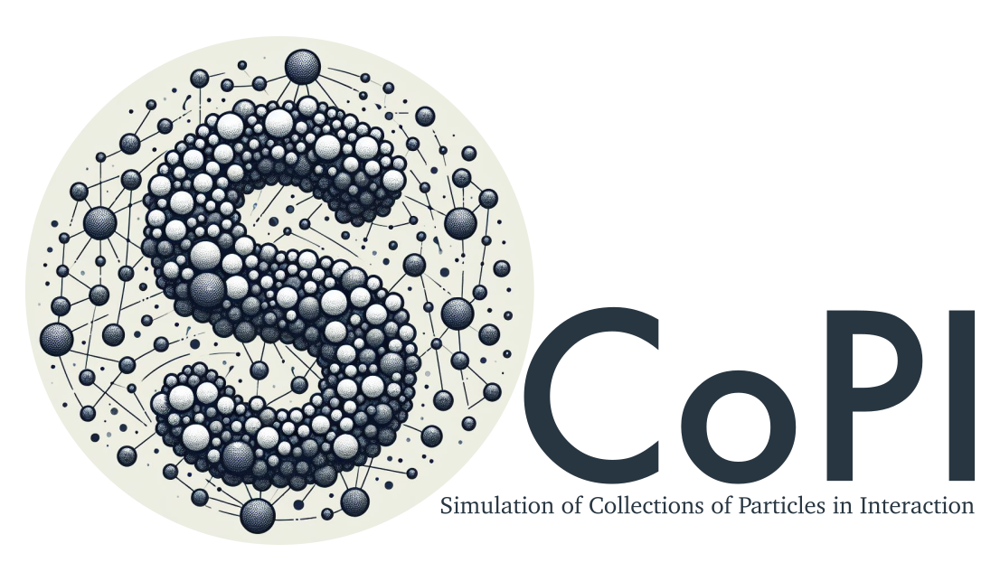

<h1 align="center">
  <a href="https://github.com/hpc-maths/scopi">
    <picture>
        <source media="(prefers-color-scheme: dark)" height="300" srcset="./doc/source/logo/dark_small.png">
        
    </picture>
  </a>
</h1>

<div align="center">
  <br />
  <a href="https://github.com/hpc-maths/scopi/issues/new?assignees=&labels=bug&template=01_BUG_REPORT.md&title=bug%3A+">Report a Bug</a>
  ·
  <a href="https://github.com/hpc-maths/scopi/issues/new?assignees=&labels=enhancement&template=02_FEATURE_REQUEST.md&title=feat%3A+">Request a Feature</a>
  ·
  <a href="https://github.com/hpc-maths/scopi/discussions">Ask a Question</a>
  <br />
  <br />
</div>

<div align="center">
<br />

[](LICENSE)
[](https://app.codacy.com/gh/hpc-maths/scopi/dashboard?utm_source=gh&utm_medium=referral&utm_content=&utm_campaign=Badge_grade)

[](https://github.com/hpc-maths/scopi/issues?q=is%3Aissue+is%3Aopen+label%3A%22help+wanted%22)
[](https://github.com/hpc-maths)


</div>

The open source software SCoPI written in C++ is designed for the Simulation of Interacting Particle Collections. It enables 2D and 3D simulation of particles (with convex shape), interacting with a surrounding medium (obstacles of various types, moving or not, gravity force, possible coupling with a fluid solver) as well as with other particles (inter-particle forces, contacts). The contact model used is of the Contact Dynamics type [^1] [^2]. It can be dry (inelastic, with or without friction) or viscous (modeling the force of lubrication in a viscous fluid [^3]). The algorithms used are implicit and reduce, at each time step, to the solution of a constrained convex problem. The latter can be solved either using the Mosek library, or via projected gradient or accelerated projected gradient algorithms. In the context of an inelastic contact model, it has been used, for example, to study the local rheology of a granular material in front of a towed sphere [^4].

<details>
<summary>Table of Contents</summary>

- [Get started](#get-started)
  - [There's more](#theres-more)
- [Features](#features)
- [Installation](#installation)
  - [From source](#from-source)
- [Get help](#get-help)
- [Project assistance](#project-assistance)
- [Contributing](#contributing)
- [License](#license)

</details>

## Get started

In this section, we propose an example of the simulation of two spheres with opposite velocities.

- Initialize SCoPI

  You have to include `<scopi/scopi.hpp>` file.

  ```cpp
  scopi::initialize("Two spheres simulation");
  ```

  SCoPI uses [cli11](https://cliutils.github.io/CLI11/book/) to manage command line options. This initialization just adds a title to your command line options. But, we plan to do much more soon for this step, so get into the habit of using it.

- Create two spheres

  You have to include `<scopi/objects/types/sphere.hpp>` file.

  ```cpp
  constexpr std::size_t dim = 2;
  scopi::sphere<dim> s1({{-0.2, -0.05}}, 0.1);
  scopi::sphere<dim> s2({{ 0.2,  0.05}}, 0.1);
  ```

  We first specify the dimension of our simulation: here is a 2D problem. Then we create two particles represented by spheres. The first argument is the center and the second one is the radius.

  SCoPI has other shapes such as superellipsoid, plan, segment and other shapes which are combinations of these.

- Create the container with all the particles

    You have to include `<scopi/container.hpp>` file.

    ```cpp
    scopi::scopi_container<dim> particles;

    particles.push_back(s1,
                        scopi::property<dim>()
                            .desired_velocity({
                                {0.25, 0}
    })
                            .mass(1.)
                            .moment_inertia(0.1));
    particles.push_back(s2,
                        scopi::property<dim>()
                            .desired_velocity({
                                {-0.25, 0}
    })
                            .mass(1.)
                            .moment_inertia(0.1));

    ```

    To apply a contact solver to our particles and make them move, we need to create a container with all the particles. When you add your particles, you can also mention certain properties such as their velocities, their masses, their rotations... You can also mention that an object is fixed and considered an obstacle.

- Create the solver and run it

  You have to include `<scopi/solver.hpp>` file.

  ```cpp
  double dt = 0.005
  scopi::ScopiSolver<dim> solver(particles, dt);

  std::size_t total_it = 100;
  solver.run(total_it);
  ```

  That's it! You have simulated no friction contact of two spheres which is the default behavior.

  The whole source file is

  ```cpp
  #include <scopi/scopi.hpp>
  #include <scopi/objects/types/sphere.hpp>
  #include <scopi/container.hpp>
  #include <scopi/solver.hpp>

  int main(int argc, char** argv)
  {
      scopi::initialize("Two spheres simulation");

      constexpr std::size_t dim = 2;
      scopi::sphere<dim> s1({{-0.2, -0.05}}, 0.1);
      scopi::sphere<dim> s2({{ 0.2,  0.05}}, 0.1);

      scopi::scopi_container<dim> particles;

      particles.push_back(s1,
                          scopi::property<dim>()
                              .desired_velocity({
                                  {0.25, 0}
      })
                              .mass(1.)
                              .moment_inertia(0.1));
      particles.push_back(s2,
                          scopi::property<dim>()
                              .desired_velocity({
                                  {-0.25, 0}
      })
                              .mass(1.)
                              .moment_inertia(0.1));

      double dt = 0.005;

      scopi::ScopiSolver<dim> solver(particles, dt);
      SCOPI_PARSE(argc, argv);

      std::size_t total_it = 100;
      solver.run(total_it);

      return 0;
  }
  ```

  `SCOPI_PARSE` allows to get access to internal options.

- Compile using CMake

  You can put the script in a file called `two_spheres.cpp` and create a `CMakeLists.txt` file with the following content

  ```cmake
  find_package(scopi)
  add_executable(two_spheres two_spheres.cpp)
  target_link_librairies(two_spheres scopi)
  ```

  Then, you can compile this C++ script using the bash command lines

  ```bash
  cmake . -B build -DCMAKE_BUILD_TYPE=Release
  cmake --build build target all
  ```

- Run

  ```bash
  ./two_spheres
  ```

  If you want to see all the options of your executable

  ```bash
  ./two_spheres -h
  ```

### There's more

If you want to learn more about scopi skills by looking at examples, we encourage you to browse the [demos](./demos) directory.

## Features

- Several objects: sphere, superellipsoid, plan, segment, worms...
- Several methods to compute the neighbors of an object: brute force or kd tree
- Several kinds of contact: no friction, friction, viscous, friction and viscous
- Several methods to solve the problem: projected gradient descent, adaptive projected gradient method

## Installation

<!-- ### From conda

```bash
mamba install scopi
```

If you want to compile your scripts, you also have to install a C++ compiler and cmake.

```bash
mamba install cxx-compiler cmake
```

And finally, if you have to use PETSc to assemble the matrix of your problem, you need to install it

```bash
mamba install petsc pkg-config
``` -->

### From source

Run the cmake configuration

- With mamba or conda

    First, you need to create the environment with all the dependencies installed

    ```bash
    mamba env create --file conda/environment.yml
    mamba activate scopi-env
    ```

    ```bash
    cmake . -B build -DCMAKE_BUILD_TYPE=Release -DBUILD_DEMOS=ON
    ```

Build the demos

```bash
cmake --build ./build --config Release
```

## Get help

<!-- For a better understanding of all the components of scopi, you can consult the documentation https://scopi.readthedocs.io. -->

If you have any questions or remarks, you can write a message on [github discussions](https://github.com/hpc-maths/scopi/discussions), and we will be happy to help you or to discuss with you.


## Project assistance

If you want to say **thank you** or/and support the active development of scopi:

- Add a [GitHub Star](https://github.com/hpc-maths/scopi) to the project.
- Tweet about scopi.
- Write interesting articles about the project on [Dev.to](https://dev.to/), [Medium](https://medium.com/) or your blog.

Together, we can make scopi **better**!

## Contributing

First off, thanks for taking the time to contribute! Contributions are what make the open-source community such an amazing place to learn, inspire, and create. Any contributions you make will benefit everybody else and are **greatly appreciated**.


Please read [our contribution guidelines](./doc/CONTRIBUTING.md), and thank you for being involved!

## License

This project is licensed under the **BSD license**.

See [LICENSE](LICENSE) for more information.

[^1]: Jean, Michel et Moreau, Jean Jacques. Unilaterality and dry friction in the dynamics of rigid body collections. In : 1st contact mechanics international symposium. 1992. p. 31-48.
[^2]: Maury, Bertrand. A time-stepping scheme for inelastic collisions. Numerische Mathematik, 2006, vol. 102, p. 649-679.
[^3]: Lefebvre, Aline. Numerical simulation of gluey particles. ESAIM: Mathematical Modelling and Numerical Analysis, 2009, vol. 43, no 1, p. 53-80.
[^4]: Seguin, A., Lefebvre-Lepot, Aline, Faure, Sylvain, et Gondret, Philippe. Clustering and flow around a sphere moving into a grain cloud. The European Physical Journal E, 2016, vol. 39, no 6, p. 63.
